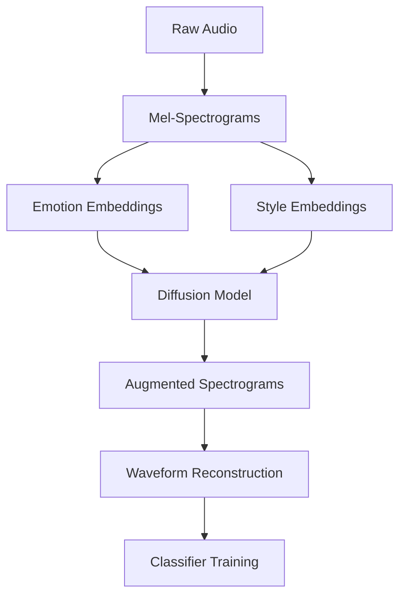

# EmoDB and RAVDESS Dataset Processing
Enhancing speech emotion recognition through diffusion-based audio augmentation. This project generates emotionally-enhanced audio samples to improve classifier performance.

## Table of Contents
- [Methodology](#methodology)
- [Key Results](#key-results)
- [Datasets](#datasets)
- [Installation](#installation)
- [Usage](#usage)

### Pipeline Overview

## Datasets

1. **EmoDB (Berlin Database of Emotional Speech)**
   - Contains emotional speech recordings from 10 actors (5 male, 5 female)
   - 7 emotions: anger, boredom, disgust, fear, happiness, sadness, neutral
   - 535 audio files in total

2. **RAVDESS (Ryerson Audio-Visual Database of Emotional Speech and Song)**
   - Contains emotional speech recordings from 24 professional actors (12 male, 12 female)
   - 8 emotions: neutral, calm, happy, sad, angry, fearful, disgust, surprised
   - 1,440 audio files in total


## Requirements

```
numpy
pandas
matplotlib
seaborn
librosa
soundfile
tqdm
```

Install the required packages with:

```bash
pip install librosa soundfile pandas matplotlib seaborn tqdm
```

## Usage

### Basic Usage

To process both datasets and save the combined data:

```bash
python main.py
```

This will:
1. Load both EmoDB and RAVDESS datasets
2. Extract audio features
3. Combine the datasets
4. Save the processed data to `output/processed_data.pkl`
5. Create visualizations for sample audio files

## Dataset Structure

### EmoDB

The filename format is: `AABCDE.wav` where:
- AA: Speaker ID (03, 08, 09, 10, 11, 12, 13, 14, 15, 16)
- B: a or b (version)
- C: Two-digit sentence ID (01-10)
- D: Emotion (W=anger, L=boredom, E=disgust, A=fear, F=happiness, T=sadness, N=neutral)
- E: a, b, c, ... (repetition)

### RAVDESS

The filename format is: `XX-YY-ZZ-AA-BB-CC-DD.wav` where:
- XX: Modality (01=full-AV, 02=video-only, 03=audio-only)
- YY: Vocal channel (01=speech, 02=song)
- ZZ: Emotion (01=neutral, 02=calm, 03=happy, 04=sad, 05=angry, 06=fearful, 07=disgust, 08=surprised)
- AA: Emotional intensity (01=normal, 02=strong)
- BB: Statement (01="Kids are talking by the door", 02="Dogs are sitting by the door")
- CC: Repetition (01=1st repetition, 02=2nd repetition)
- DD: Actor (01 to 24. Odd numbered actors are male, even numbered actors are female)
